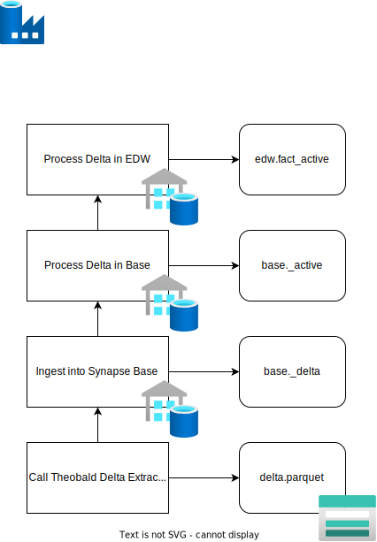
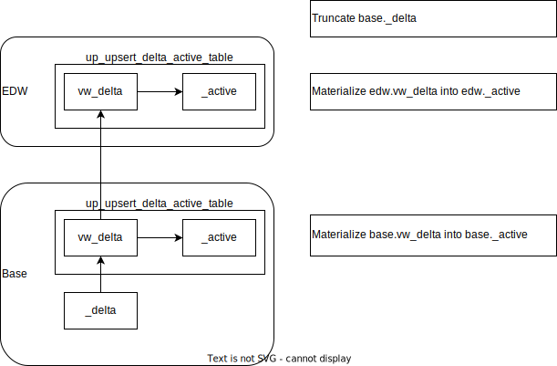

This section describes the process of processing of delta in the base layer and the edw layer. 

# High Level Process

The high-level process of handling delta is as follows:

1. Get delta entity batch activities

   Calculate for each delta entity, which delta parquet files need to be processed. Processing can include any of the activities from [Entity Batch Activities](#entity-batch-activities). Based on logged data in the Orchestration DB, a stored procedure calculates which activities for each delta parquet file for each delta entity is required. 
1. Process each delta entity

   1. Get the delta entity file name batch activities
   1. Process each delta entity file name batch activity

      1. Extract
      1. Get Extraction Status
      1. Store Extraction Logs
      1. Test for Duplicates
      1. Ingest into Synapse SQL Pool Base Delta
         
         (without truncate because multiple parquet files can be ingested into same base delta table)

1. If required
   1. Process the delta info in the base layer of Synapse SQL Pool

      Insert and update 
      
      Full tables are only truncated when data is actually loaded from parquet to Synapse Base. For delta entities, multiple delta parquet files can be loaded into the same base table. Therefore, one cannot truncate this table before each delta file is inserted.

1. Delta in EDW

   In the EDW layer, the corresponding edw entity transforms the data as usual but is in the end referencing the base layer delta view instead of the base layer table. This means a lot less data requires transforming. After successful materialization into the edw delta table, the base delta table is truncated. 

# Entity Batch Activities

1. Extract 

   Run the Xtract Universal extraction for this delta entity and store the delta parquet file on ADLS. Additional delta fields are added to the delta entity ODP extraction:
   - `TS_SEQUENCE_NUMBER`

     A sequence number defining the chronological order of the delta records
   - `ODQ_CHANGEMODE`

     A character defining the delta operation: insert, update, delete
   - `ODQ_ENTITYCNTR`

     Value defining if a row is added or removed

1. Get Extraction Status
1. Store Extraction Log
1. Test for Duplicates
1. Ingest into Synapse Base

   Ingest the delta parquet file into a base delta table in Synapse SQL Pool, e.g. base_s4h_cax.I_GLAccountLineItemRawData_delta
1. Process Base

   For a delta entity, this step is executed after all required delta parquet files have been ingested into Synapse SQL Pool Base. It processes the new delta parquet files and applies the delta information in the active table that contains the latest up to date status. It runs the stored procedure utilities.up_upsert_delta_active_table which creates dynamic SQL queries for both an insert statement and update statement. 

# Delta structure in Synapse SQL Pool

## Base

`entity_delta`

This table contains delta records from potentially multiple delta parquet files

`vw_entity_delta`
1. In a single delta parquet file, multiple updates on the same key can exist
1. Additionaly, multiple delta parquet files can be ingested into the same delta table before this table is truncated.

This view retrieves the most recent status for each key taking into account point 1 and 2. 

`up_upsert_delta_active_table`

Stored Procedure that updates existing records and inserts new records in `entity_active` based on `vw_entity_delta`. This stored procedure is executed during the **Process Base** step. 

`entity_active`

Contains the actual latest status of all previously ingested delta parquet files. This table allows us to compare the data between full load and delta load.

## EDW

`vw_entity_delta`

This view handles the required transformations to be materialized in the edw-layer. It references the delta view from the base layer to make sure only the new delta data is transformed.

`up_upsert_delta_active_table`

The same stored Procedure is called to handle delta processing in the EDW layer from the view logic into the delta active table. 

`entity_active`

Contains the actual latest status of all previously ingested delta parquet files.

## up_upsert_delta_active_table

This stored procedure handles the delta materialization and expects the following parameters:
- `schema_name`, schema name
- `delta_view_name`, the name of the source delta view
- `active_table_name`, the name of the target active table

The stored procedure works by leveraring Dynamic SQL to create an `insert` query and an `update` query. 
